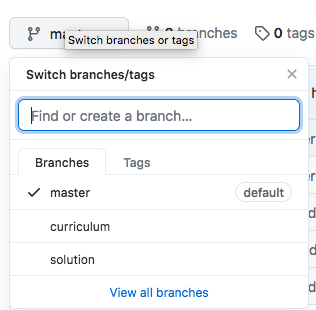
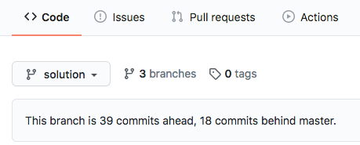

# Welcome to Prework!

### Goals 

We've set up a "prework" course for you to complete before your first day of bootcamp.

This allows you to make sure you've got the foundation of skills you need to navigate the material in the first week, and to get used to working through the online material we'll be providing throughout the program.  (In general, think of the online material as the "textbook" that you'll be reading before the lectures in class.)  

Working through this prework material is not *required*, but it is **extremely** highly-recommended.  One of the most frequent comments from both alums and current students early in the progam is wishing they had started with a better foundation in the skills the prework focuses on:
- Python
- Numpy and Pandas
- Data Visualization

Not only does completing the prework allow for an easier adjustment to the first few weeks, it also provides a solid foundation that allows better progress through the more challenging material later on in the bootcamp, and ultimately to have a better "capstone" project to show to potential employers.


### Learning methods
Here are a few best practices to follow when working through this material:


- Work through each section, **enough that you can remember the material**, before moving on to the next section. **This may require repeating specific labs**.  

- Type every line of code you read or write 5 separate times.  (This may seem repetitive or unnecessary, but a large part of coding is getting the "muscle memory" of specific code into your fingers!)


- Say out loud what each piece of code is doing.  Part of learning to code is seeing the narrative of what is going on instead of just lines of specific instructions.
  - For example, for ```x = [5,6,7]``` you would say, out loud, "a list of integers from 5 to 7 is assigned to a variable named 'x' "
  
  
- *Instructions to see the solutions*: there are two ways to see the solutions to a lab.

  - ##### First way: 
    Click "finished" on the right-hand side of the page.  A grey `solutions` button will pop up.  
  

  - ##### Second way:
  
    Part of the Flatiron program is to use an industry-standard tool called github to manage files.  The main unit used to house files is called a `repository`, or `repo` ("ree-po") for short.  The github logo looks like this:             

    
    Click on the small github logo in the upper-right hand corner of the page to be taken to the github page with the solutions.
    
    Github allows different versions of files to be stored in the same `repo`, using different spaces called `branches`. Look in the upper-left corner of a `repo` to see which branch you're in. For example, this indicates you're viewing the `master` branch

    
    Solutions to labs are located in the `solution` branch.  
    
    To navigate to the `solution` branch, click on the button which lists the current branch, then click on `solution`                         

   
    You should see that you are now viewing files stored in the `solution` branch

   
- Check the solutions only when you're done with the lab.  Remember, getting stuck and working through individual pieces of code and concepts is part of the process.  
    
- If you can't figure out why your code isn't working, look back to the section of prework that teaches that code, or try googling for information about the specific syntax you're trying to use.  ("90% of programming is googling StackOverflow").  
    
- If you get completely stuck and need to check the solutions to move forward, just look at the specific solution for the piece you got stuck on, instead of reading the solutions for the entire lab.

- For every solution you see, type out the code 5 times and say what the code is doing out loud!

- In coding in general and python specifically, there are lots of ways to accomplish any given task.  It is a common occurence to encounter code in the solutions that accomplishes the same result as the code you wrote but in a different way.  Consider why the solution code might be written differently than your code, even though it accomplishes the same thing.  
  - Things to ask yourself if the solution code is different than your answer but accomplishes the same thing: 
    - Is the code in the solution shorter?  
    - Is it easier to read?  
    - Does it use different components?  
    - Is it structured in a different way?
  
# Enjoy the prework, and good luck! 